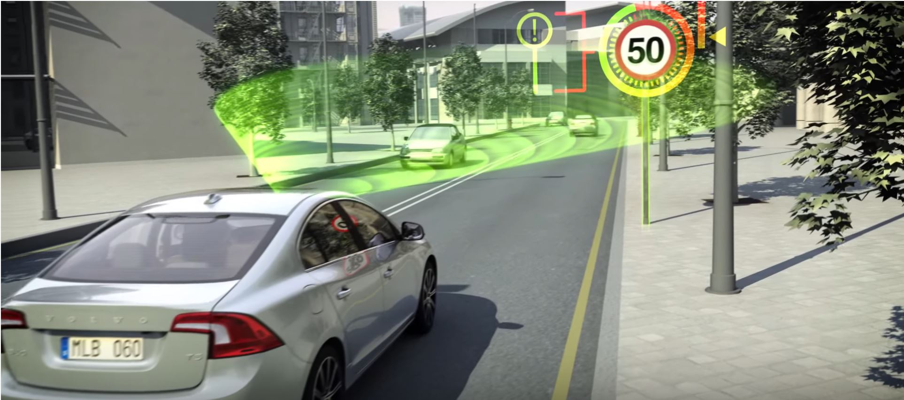
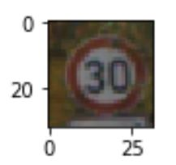
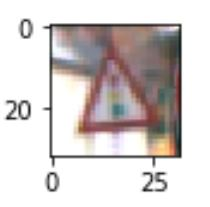
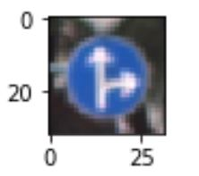
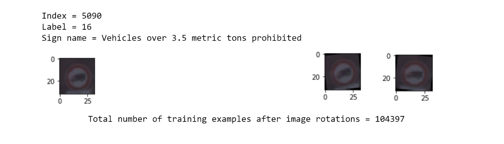
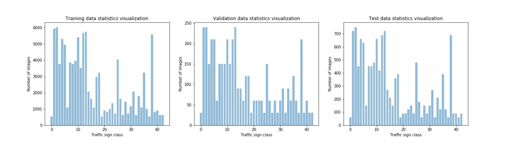
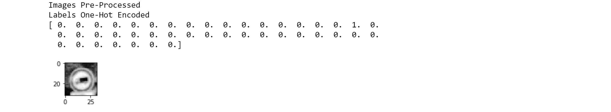
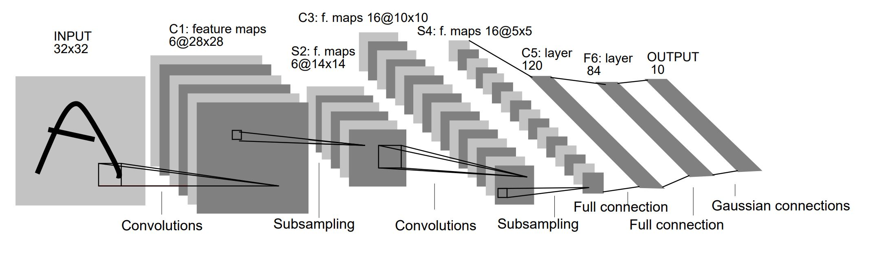
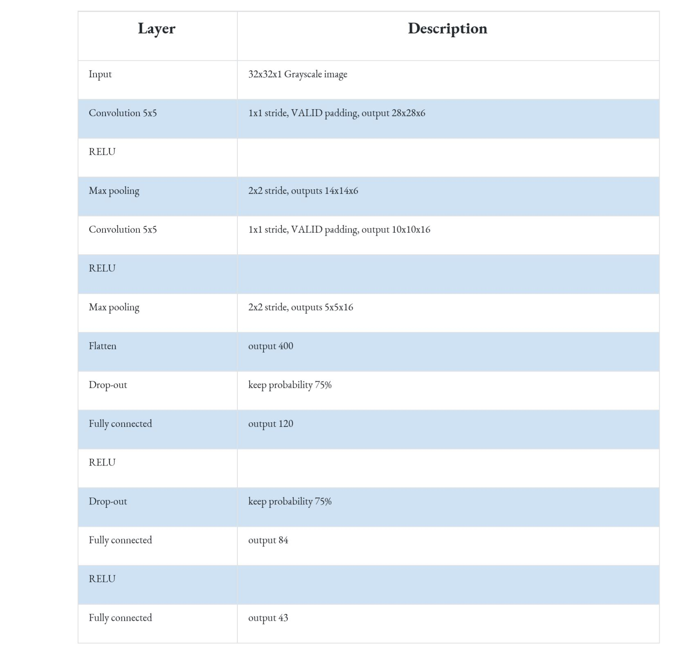

# Traffic-Sign-Classifier
Traffic signs recognition using Convolutional Neural Networks.


Photo source: [Motornature](http://www.motornature.com/)

Traffic sign recognition is crucial for a self driving car. Even though speed limit information may be available in the map and navigation system, other signs like "no passing" or "yield" are very important when it comes to making a decision while driving autonomously. 

Car manufacturers have already introduced this feature for their high end line vehicles, using the front facing camera sensor and deploying computer vision techniques as well as machine learning based classifiers. While this is largely used in standard vehicles for driver information in the instrument cluster or for automatic cruise control, self driving cars still rely on this technique to gather more information about traffic rules. 

For this project I am going to implement a traffic sign recognition algorithm based on European signalisation. 

In order to _teach_ a car how to recognise signs and classify them correctly, I am going to start with a data set of existing images and a corresponding set of labels. Most of the work is done _offline_ and includes processing the images, designing and training a convolutional neural network. 
The trained convolutional neural network is then used _online_, meaning that it runs in real time on the car to recognize traffic signs that it sees for the first time.

This project is implemented in Python using TensorFlow, the source code can be found in *Traffic_Sign_Classifier.ipynb* file above. The starting code for this project is provided by Udacity and can be found [here](https://github.com/udacity/CarND-Traffic-Sign-Classifier-Project)


## Dataset Exploration and Augmentation 

When working with existing labeled data, the first step is to get familiar with how the data looks like, how many classes are used, and how big is the data set.

 
   


From this first data exploration, the impression I get is that the images are squared and the traffic sign is nicely occupying almost the entire frame. The data set is quite large as a whole, and that there are 43 classes of traffic signs.

The second step is to split the data in _training, validation_ and _test_ sets.

Splitting the data in three sets is a custom approach when working with neural networks. The training data is used to feed the network during the learning process and train the weights and biases. The validation data is used for the human interpretation of how well the network performs. Based on these observations, the human will tune the network's hyperparameters to increase the performance factor. This is how the validation data bleeds into the network's design and it can no longer be consider a viable reference for performance analysis. Test data is used only when the design is stable and is a reliable way to analyse the network's performance, using images that were not seen before in the training process.

In terms of size, the validation set is a little over a tenth of the training data and the test data is about a third of the training set.

At the begining, I thought that this amount of data would be more than sufficient for my traffic sign classifier to perform well. After I designed and tunned my convolutional neural network I realized that I was not able to get the accuracy above 80%. Because of this, I decided to increase the training data set by rotating each image twice, 10 degrees left respectively 10 degrees right. I found this to be the most important factor that increases the accuracy on the validation data set. 


```
# Increase the training data set
# Rotate images 10 degrees right respectively 10 degrees right to add to the train data set

def rotateImage(image, angle):
    image_center = tuple(np.array(image.shape[1::-1]) / 2)
    rot_mat = cv2.getRotationMatrix2D(image_center, angle, 1.0)
    result = cv2.warpAffine(image, rot_mat, image.shape[1::-1], flags=cv2.INTER_LINEAR)
    return result

X_train_rotated_right = np.array([rotateImage(image, -10) for image in X_train])
y_train_rotated_right = y_train

X_train_rotated_left = np.array([rotateImage(image, 10) for image in X_train])
y_train_rotated_left = y_train
```





Part of the data exploration is also to get an idea if the images are equally distributed among classes or not, and to compare the statistics between training, validation and test data sets. As shown in the charts below, the data is not equally distributed and there are classes that are  obviously more represented than others, but the statistics are quite homogenous between the three data sets so I did not compensate for that.





## Model Architecture and Design 

Data pre-processing is a key aspect when designing a model. This makes a big difference on how well the CNN (Convolutional Neural Network) will perform as it is important to decide which features are worth learning. 

When randomly looking through the images I noticed that a lot of them are quite dark, but not all of them. I decided to equalize the histogram for each image so that my CNN will not have to learn that darkness is not a feature that helps distinguish between traffic signs. I also noticed that a better performance is obtained on grayscale images and the normalization of the image values does not seem to help. 

```
# Equalize histogram
# Convert to gray scale

def equalize_gray(image):
    image_gray = cv2.cvtColor(image, cv2.COLOR_RGB2GRAY)
    image_output = cv2.equalizeHist(image_gray)
    return image_output#(image_output-128)/128
    
if not is_data_preprocessed: 
    X_train = np.reshape(np.array([equalize_gray(image) for image in X_train]), (-1, 32, 32, 1))
    X_valid = np.reshape(np.array([equalize_gray(image) for image in X_valid]), (-1, 32, 32, 1)) 
    X_test  = np.reshape(np.array([equalize_gray(image) for image in X_test]),  (-1, 32, 32, 1))
    is_data_preprocessed = True
    print('Images Pre-Processed')
    
```

The image pre-processing has the effect shown below. 


Another aspect is processing the label values. Since the initial form of the labels are integers from 0 to 42, I decided to turn them into one-hot-encoded values. This is very important for the CNN's training step. Since the CNN computes 43 probability values from 0 to 1 through the use of `softmax` sigmoid, the easiest way to compute the error is by comparing the output to a one-hot-encoded label.

```
# One hot encoding of labels
from sklearn.preprocessing import OneHotEncoder

if not is_labels_encod:
    onehot_encoder = OneHotEncoder(sparse=False)
    y_train = y_train.reshape(len(y_train), 1)
    y_valid = y_valid.reshape(len(y_valid), 1)
    y_test  = y_test.reshape(len(y_test), 1)
    y_train = onehot_encoder.fit_transform(y_train)
    y_valid = onehot_encoder.fit_transform(y_valid)
    y_test  = onehot_encoder.fit_transform(y_test)
    is_labels_encod = True
    print('Labels One-Hot Encoded')
```

Below is an image that is initially labeled ‘16’ with its one-hot-encoded new label.

 


Now that the data and labels are processed, it is time to design the CNN. One way would be to start from scratch and add layers as the experimentation goes, but this is time consuming and does not take advantage of the already existing research in the field.

One particular architecture is well suited for the traffic sign classification task. This is [LeNet by Yann LeCun](http://yann.lecun.com/exdb/publis/pdf/lecun-01a.pdf) that was developed in 1998 for letters and digits recognition.

 


 