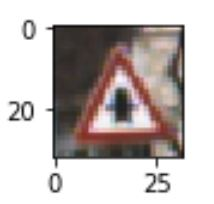

# Traffic-Sign-Classifier
Traffic signs recognition using Convolutional Neural Networks.

Photo source: [Motornature](http://www.motornature.com/)

Traffic sign recognition is crucial for a self driving car. Even though speed limit information may be available in the map and navigation system, other signs like "no passing" or "yield" are very important when it comes to making a decision while driving autonomously. 

Car manufacturers have already introduced this feature for their high end line vehicles, using the front facing camera sensor and deploying computer vision techniques as well as machine learning based classifiers. While this is largely used in sandard vehicles for driver inforamtion in the instrument cluster or for automatic cruise control, self driving cars still rely on this technique to gather more information about traffic rules. 

For this project I am going to implement a traffic sign recognition algorithm based on European signalisation. 
In order to _teach_ a car how to recognise signs and classify them correctly, I am going to start with a data set of existing images and a corresponding set of labels. Most of the work is done _offline_ and includes processing the images, designing and training a convolutional neural network. 
The trained convolutional neural network is then used _online_, meaning that it runs in real time on the car to recognize traffic signs that it sees for the first time.

This project is implemented in Python using TensorFlow, the source code can be found in *Traffic_Sign_Classifier.ipynb* file above. The starting code for this project is provided by Udacity and can be found [here](https://github.com/udacity/CarND-Traffic-Sign-Classifier-Project)

## Dataset Exploration and Data Augmentation 
When working with existing labeled data, the first step is to get familiar with how the data looks like, how many classes are used, and how big is the data set.

 
   

This is also the point when the data is split in _training, validation_ and _test_ data.

Splitting the data in three sets is a custom approach when working with neural networks. The training data is used to feed the network during the learning process and train the weights and biases. The validation data is used for the human interpretation of how well the network performs. Based on these observations, the human will tune the network's hyperparameters to increase the performance factor. This is how the validation data bleeds into the network's design and it can no longer be consider a viable reference for performance analysis. Test data is used only when the design is stable and is a reliable way to analyse the network's performance, using images that were not seen before in the training process.

In terms of size, the validation set is a little over a tenth of the training data and the test data is about a third of the training set.

'''
Number of training examples = 34799
Number of validation examples = 4410
Number of testing examples = 12630
Image data shape = (32, 32, 3)
Number of classes = 43
'''

From this first data exploration, the impression I get is that the images are squared and the traffic sign is nicely occupying almost the entire frame. The data set is quite large as a whole, and that there are 43 classes of traffic signs.

At the begining, I thought that this amount of data would be more than sufficient for my traffic sign classifier to perform well. After I designed and tunned my convolutional neural network I realized that I was not able to get the accuracy above 80%. Because of this, I decided to increase the training data set by rotating each image twice, 10 degrees left respectively 10 degrees right. I found this to be the most important factor that increases the accuracy on the validation data set. After this, the training set got three times larger.  

Part of the data exploration is also to get an idea if the images are equally distributed among classes or not, and to compare the statistics between training, validation and test data sets. As shown int he graphs below, the data is not equally distributed and there are classes that are  obviously more represented than others, but the statistics are quite homogenous between the three data sets so I did not compensate for that.

